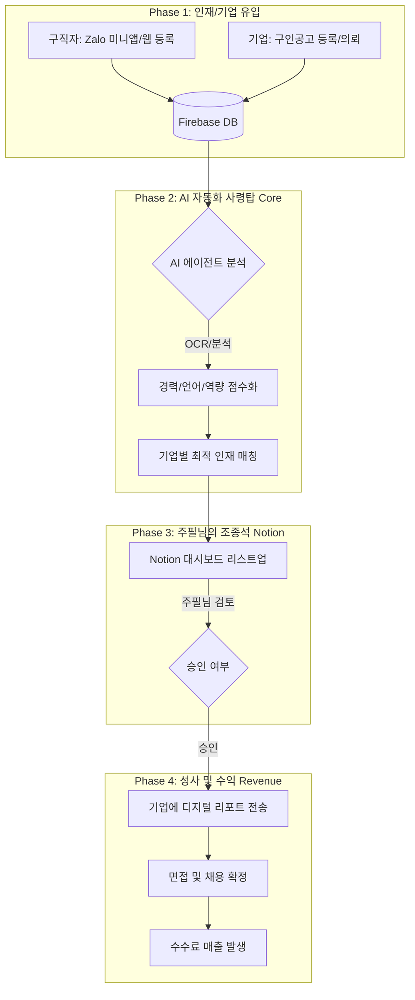

# 구인구직 사업 관리 플랫폼 기획서
> 작성일: 2026-03-23

---

## 1. 전체 시스템 아키텍처 (System Architecture)

```
[인재 유입]                    [AI 자동화 사령탑]              [주필님 조종석]           [수익]
구직자: Zalo 미니앱/웹 등록 ──→ Firebase DB ──→ AI 에이전트 분석    ──→ Notion 대시보드   ──→ 디지털 리포트 전송
기업: 구인공고 등록/의뢰   ──→              ──→ 경력/언어/역량 점수화 ──→ 주필님 검토/승인  ──→ 면접 및 채용 확정
                                           ──→ 기업별 최적 인재 매칭                      ──→ 수수료 매출 발생
```

### 플로우 다이어그램 (Mermaid)



---

## 2. 핵심 기능 구현 리스트 (Implementation Tasks)

### ① [데이터 시스템] Firebase & AI 연결
- **목표**: 이력서가 들어오는 즉시 데이터로 변환
- **AI 개발 작업**:
  - PDF에서 텍스트를 추출하는 OCR 엔진 구축
  - `candidates` 컬렉션 자동 업데이트 로직 작성
- **주필님 작업**:
  - 기존 카카오톡/앱으로 들어온 이력서들을 Firebase에 샘플로 업로드
  - 분석 정확도 테스트

### ② [사령탑] AI 매칭 엔진 및 Notion 연동
- **목표**: 자동으로 '찰떡궁합' 인재 추천
- **AI 개발 작업**:
  - `jobs`와 `candidates` 데이터를 비교하여 적합도 점수 산출하는 프롬프트 엔지니어링
  - Notion API 연동
- **주필님 작업**:
  - Notion 화면 구성 확정 (이름, 점수, 요약, 연락처 등 항목 결정)

### ③ [사용자 창구] Zalo 미니 앱
- **목표**: 베트남 현지인과 한국인이 편하게 접속하는 입구
- **AI 개발 작업**:
  - Firebase와 연동되는 React 기반 Zalo 미니앱 프런트엔드 개발
- **주필님 작업**:
  - Zalo 비즈니스 계정 승인 및 미니앱 파트너 등록 행정 업무

---

## 3. 수익 모델 (Revenue Model)

| 수익 항목 | 방식 | 단가 (예시) | 비고 |
|-----------|------|------------|------|
| 성공 수수료 | 채용 확정 시 발생 | 연봉의 10~15% | 주력 수익원 (베트남 표준) |
| AI 리포트 판매 | 기업에 상위 5명 상세 리포트 제공 | 건당 $100 | 면접 전 유료 열람 서비스 |
| 광고/배너 | Zalo 미니앱 내 상단 노출 | 월간 구독형 | 잡지 광고와 패키지 판매 가능 |

---

## 4. 사업 진행 로드맵 (Execution Roadmap)

| 기간 | 목표 | 세부 내용 |
|------|------|----------|
| **1~2주차** | 사령탑 구축 | Firebase + Notion + AI 분석기 구축. 이 단계에서 이미 수동 영업 가능 |
| **3~4주차** | 자동화 고도화 | 자동 매칭 로직 고도화 및 실제 이력서 100건 대상 시뮬레이션 |
| **5~8주차** | Zalo 미니앱 배포 | Zalo 미니앱 배포 및 기존 잡지 네트워크를 통한 대대적 구직자 유입 |

---

## 5. 기술 스택 (Tech Stack)

| 레이어 | 기술 | 용도 |
|--------|------|------|
| **데이터베이스** | Firebase Firestore | 후보자/기업/채용공고 데이터 저장 |
| **스토리지** | Firebase Storage | 이력서 PDF/이미지 저장 |
| **AI/OCR** | Google Vision API / OpenAI | 이력서 분석 및 매칭 점수화 |
| **조종석** | Notion API | 주필님 검토 대시보드 |
| **사용자 창구** | React (Zalo Mini App) | 구직자/기업 입력 UI |
| **백엔드** | Firebase Functions (Node.js) | AI 분석 트리거 및 자동화 로직 |
| **알림** | Zalo OA / 카카오톡 | 매칭 결과 알림 |

---

## 6. Firebase 데이터 구조 (Database Schema)

```
Firestore
├── candidates/          # 구직자
│   ├── {candidateId}
│   │   ├── name (string)
│   │   ├── phone (string)
│   │   ├── email (string)
│   │   ├── nationality (string)      # KR / VN
│   │   ├── languages (array)         # ["Korean", "Vietnamese", "English"]
│   │   ├── experience (array)        # 경력 목록
│   │   ├── skills (array)
│   │   ├── resumeUrl (string)        # Firebase Storage URL
│   │   ├── aiScore (number)          # AI 분석 종합 점수
│   │   ├── aiSummary (string)        # AI 요약
│   │   ├── status (string)           # active / matched / hired
│   │   └── createdAt (timestamp)
│
├── companies/           # 기업
│   ├── {companyId}
│   │   ├── name (string)
│   │   ├── industry (string)
│   │   ├── contactPerson (string)
│   │   ├── phone (string)
│   │   └── createdAt (timestamp)
│
├── jobs/                # 채용공고
│   ├── {jobId}
│   │   ├── companyId (ref)
│   │   ├── title (string)
│   │   ├── requiredLanguages (array)
│   │   ├── requiredSkills (array)
│   │   ├── salary (object)           # { min, max, currency }
│   │   ├── status (string)           # open / closed
│   │   └── createdAt (timestamp)
│
└── matches/             # AI 매칭 결과
    ├── {matchId}
    │   ├── candidateId (ref)
    │   ├── jobId (ref)
    │   ├── score (number)            # 적합도 점수 (0~100)
    │   ├── notionPageId (string)     # Notion 연동 ID
    │   ├── status (string)           # pending / approved / rejected / hired
    │   └── createdAt (timestamp)
```
